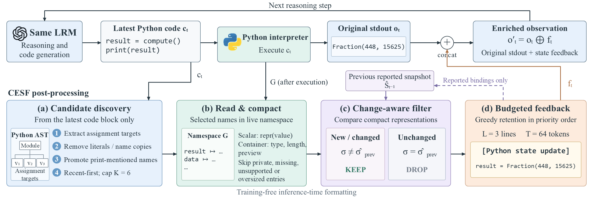
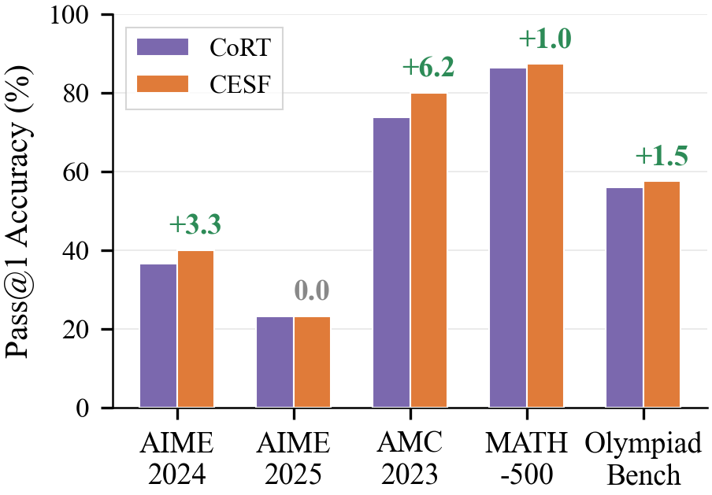
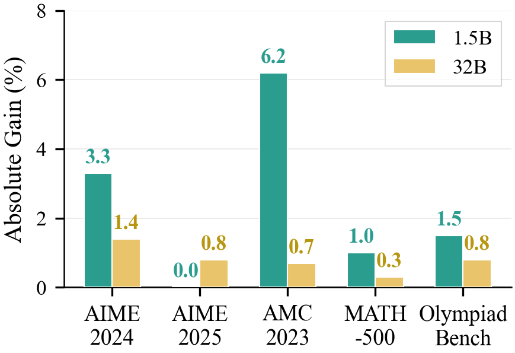
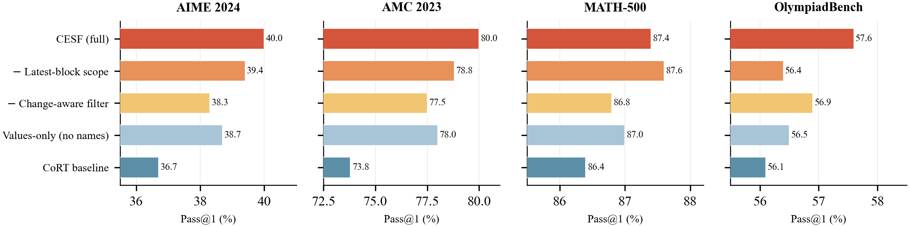
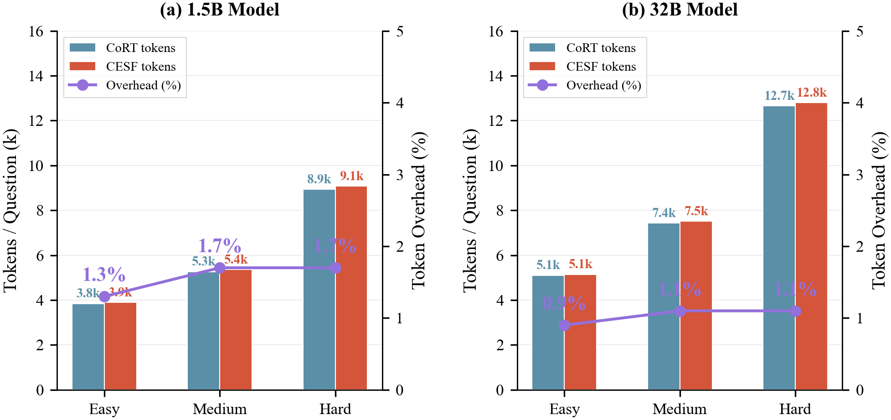

# CESF: Compact Execution-State Feedback

**Training-free execution-state feedback for code-augmented mathematical reasoning.**

Code interpreters usually return only standard output. CESF also exposes a small set of useful runtime bindings, helping a reasoning model retain intermediate computations without changing its weights or adding another model call.

This repository provides the CESF core implementation, a standalone integration API, paired evaluation and ablation runners, and selected figures and results from **Compact Execution-State Feedback for Code-Augmented Mathematical Reasoning**. Experimental settings and reported numbers below follow the current manuscript. Preparing this release did not rerun the model experiments.

## Method



CESF runs after the interpreter executes a code block:

1. **Candidate discovery:** parse the latest block, filter trivial assignments, prioritize print-mentioned variables, and select up to six eligible bindings.
2. **Read and compact:** read values from the execution namespace and create compact representations.
3. **Change filtering:** compare representations against the saved snapshot.
4. **Budgeted feedback:** append at most three binding lines within a 64-token allowance to the normal tool output.

The formatter does not execute code or inspect reference answers. The extracted implementation retains the behavior of the available source; [implementation notes](docs/implementation.md) document details that differ from the manuscript's pseudocode, including snapshot updates and value formatting.

## Quick start

Python 3.10 or later is sufficient for the core package. No model, GPU, or network connection is needed for the demo and unit tests.

```bash
python -m pip install -e .
python examples/demo.py
python -m unittest discover -s tests -v
python tests/runner_smoke.py
```

Example output:

```text
21
[Python state update]
result = 21

Repeated state: no additional feedback.
```

Integrate with an existing interpreter and the model's tokenizer:

```python
from cesf import CESF

feedback = CESF(tokenizer)  # one instance per reasoning trajectory
observation = feedback.format(
    latest_code="result = x + y\nprint(result)",
    namespace={"x": 17, "y": 4, "result": 21},
    stdout="21",
    remaining_tokens=64,
    execution_ok=True,
)
tool_output_for_model = observation.output
extra_token_cost = len(observation.token_ids)
```

Pass the namespace produced by your interpreter. Charge the returned feedback tokens to the remaining trajectory budget and call `reset()` before starting a new problem. The demo uses a character-count tokenizer solely to run without dependencies; use the model tokenizer for actual inference.

## Main results

The following rows reproduce the manuscript's main-results table. Accuracy is reported in percent; the average column is copied as reported. CoRT-PH and CoRT-HE denote Prompt-Hint and Hint-Engineering. These selected control and CESF rows are marked as reproduced results in the manuscript.

| Model | Scale | AIME24 | AIME25 | AMC23 | MATH500 | OlympiadBench | Average |
|---|---|---:|---:|---:|---:|---:|---:|
| CoRT-HE | 32B | 72.2 | 56.0 | 90.5 | 95.2 | 68.9 | 76.6 |
| **CESF** | **32B** | **73.6** | **56.8** | **91.2** | **95.5** | **69.7** | **77.4** |
| CoRT-HE | 1.5B | 34.9 | 22.7 | 70.0 | 84.9 | 54.6 | 53.4 |
| CoRT-PH | 1.5B | 36.7 | 23.3 | 73.8 | 86.4 | 56.1 | 55.3 |
| **CESF** | **1.5B** | **40.0** | **23.3** | **80.0** | **87.4** | **57.6** | **57.7** |

On the 1.5B model, the manuscript reports gains of **+3.3** percentage points on AIME24, **+6.2** on AMC23, **+1.0** on MATH500, and **+1.5** on OlympiadBench; AIME25 is unchanged.





Machine-readable table: [main_results.csv](results/main_results.csv).

## Ablation study

These values follow the manuscript's 1.5B ablation table.

| Configuration | AIME24 | AIME25 | AMC23 | MATH500 | OlympiadBench | Average |
|---|---:|---:|---:|---:|---:|---:|
| CESF (full) | 40.0 | 23.3 | 80.0 | 87.4 | 57.6 | 57.7 |
| Without latest-block scope | 39.4 | 23.3 | 78.8 | 87.6 | 56.4 | 57.1 |
| Without change-aware filter | 38.3 | 23.0 | 77.5 | 86.8 | 56.9 | 56.5 |
| Values only | 38.7 | 23.3 | 78.0 | 87.0 | 56.5 | 56.7 |
| CoRT baseline | 36.7 | 23.3 | 73.8 | 86.4 | 56.1 | 55.3 |



Removing latest-block scoping slightly improves MATH500 while reducing performance on other benchmarks. Change filtering and variable names contribute to the full method's overall performance.

Machine-readable table: [ablation.csv](results/ablation.csv).

## Efficiency

The manuscript reports the following averages on the 1.5B model:

| Metric | CoRT baseline | CESF |
|---|---:|---:|
| Tokens per question | 6,016 | 6,111 |
| Interpreter calls per question | 3.9 | 3.7 |
| Token overhead | — | +1.6% |
| CESF coverage | — | 72% |



## Evaluation settings

All experimental settings below are taken from the current manuscript, not earlier development runs.

| Setting | Value |
|---|---|
| Independent run seeds | 42, 985, 211 |
| Reported statistic | Mean accuracy across three runs |
| Samples for AIME24, AIME25, AMC23 | avg@16 |
| Samples for MATH500, OlympiadBench | avg@4 |
| Temperature / top-p | 0.6 / 0.95 |
| Maximum trajectory tokens | 32,768 |
| Maximum interpreter calls | 15 |
| Candidate / binding-line / feedback-token caps | 6 / 3 / 64 |
| Reported environment | NVIDIA A100 80GB, Ubuntu 22.04, Python 3.12, PyTorch 2.12.1, CUDA 13.0, vLLM |

The five benchmarks contain 30, 30, 40, 500, and 675 questions respectively, totaling 1,275.

See [evaluation instructions](docs/evaluation.md) for local checkpoints, dependencies, input format, and the three-seed launcher. [paper_protocol.json](reproduction/paper_protocol.json) records the manuscript settings. Runners adapted from the available source are provided as executable evaluation scaffolding; they have not been used to independently reproduce the manuscript results during this release.

## Repository layout

```text
cesf/            Core formatter, integration API, ablation feedback
examples/        Minimal runnable example
tests/           Core regression tests and a mocked runner test
reproduction/    Paired runners, interpreter workers, paper protocol
results/         Tables transcribed from the current manuscript
figures/         Selected manuscript figures
docs/            Implementation details, evaluation guide, provenance
```

## Dependencies and attribution

The code-augmented model and original prompt/parser conventions build on `Github.CoRT`. The evaluation ecosystem includes `vLLM`, `Transformers`, `Math-Verify`, `DeepScaler`, and `SymPy`. Checkpoints, benchmark datasets, and upstream repositories will be released after peer-reviewing.

All linked assets are stored inside this repository.
